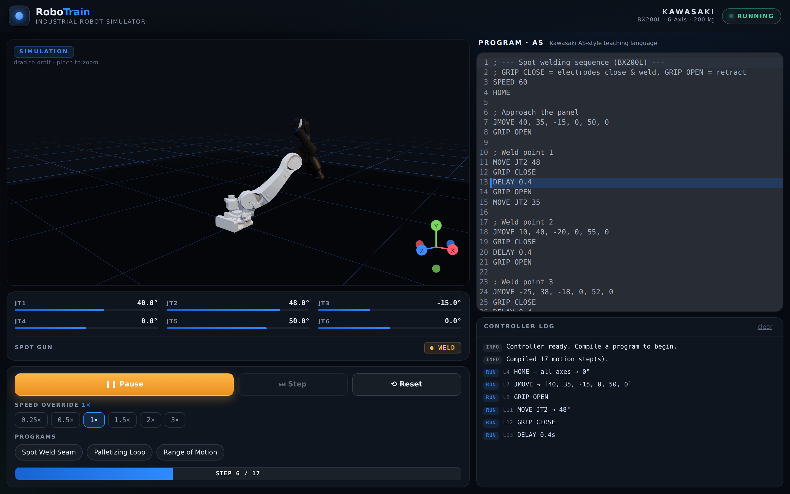

# RoboTrain — Industrial Robot Simulator

A mobile-first training app where trainees **write a program for an industrial
robot, run it, and watch a 3D Kawasaki arm execute the motion** in real time.

Built with **Vite + React + TypeScript**, **React Three Fiber** for the 3D cell,
and **CodeMirror** for the program editor. The first supported robot is the
**Kawasaki BX200L** body-shop spot-welding robot, rendered from its **genuine
CAD meshes** (binary STL, one per link) assembled with the standard Kawasaki 6R
kinematic convention. The loader is parametric, so other robot models can be
dropped in by adding their meshes + link lengths.

### Modelled BX200L specification

| | |
|---|---|
| Payload | 200 kg |
| Horizontal reach | 2,597 mm |
| Vertical reach | 3,420 mm |
| Repeatability | ±0.2 mm |
| Axis ranges | JT1 ±160° · JT2 +76/−60° · JT3 +90/−75° · JT4 ±210° · JT5 ±125° · JT6 ±210° |
| End effector | C-type spot-welding gun (electrodes driven by `GRIP`) |



## Features

- **3D robot cell** — the real Kawasaki **BX200L** rendered from its CAD meshes,
  with a correct 6-axis kinematic chain (base swivel → lower arm → upper arm →
  3-axis hollow wrist → flange) and the factory livery (white base/lower-arm,
  black upper-arm and wrist). Studio lighting, shop-floor grid, contact shadows
  and orbit/pinch camera.
- **Program editor** — write motion programs in a simplified **Kawasaki
  AS-style** teaching language. The currently-executing line is highlighted live.
- **Deterministic simulator** — programs compile to a motion plan and play back
  with eased joint interpolation. Transport controls: **Run / Pause / Step /
  Reset** plus a **0.25×–3× speed override**.
- **Live telemetry** — per-axis angle readouts with travel bars and spot-gun
  state, updated from the simulation clock.
- **Controller log** — compile diagnostics (limit violations, syntax errors) and
  a running execution trace.
- **Responsive** — tabbed Robot-Cell / Program views on phones; side-by-side
  split on tablet/desktop.

## Quick start

```bash
npm install
npm run dev      # http://localhost:5173
npm run build    # type-check + production build
```

## The AS-style teaching language

Case-insensitive. Comments start with `;` or `#`.

| Statement | Meaning |
|---|---|
| `SPEED <1-100>` | Set motion speed (% of max joint rate) |
| `HOME` | Move every axis to 0° |
| `JMOVE j1,j2,j3,j4,j5,j6` | Coordinated joint move to an absolute pose |
| `MOVE JT<n> <deg>` | Move one axis to an absolute angle |
| `JOG JT<n> <deg>` | Move one axis by a relative amount |
| `DELAY <seconds>` | Hold the current pose |
| `GRIP OPEN` / `GRIP CLOSE` | Open / close the spot-gun electrodes (weld) |
| `LOOP <n> … ENDLOOP` | Repeat a block N times (nestable) |

Joint targets that exceed each axis's mechanical limit are flagged in the
console and clamped. Three starter programs (**Spot Weld Seam**, **Palletizing
Loop**, **Range of Motion**) ship in the **PROGRAMS** chips.

```
; Spot weld two points on a panel
SPEED 60
HOME
JMOVE 40, 35, -15, 0, 50, 0
GRIP OPEN
MOVE JT2 48
GRIP CLOSE      ; electrodes close → weld
DELAY 0.4
GRIP OPEN       ; retract
JMOVE 10, 40, -20, 0, 55, 0
GRIP CLOSE
DELAY 0.4
GRIP OPEN
HOME
```

## Architecture

```
src/
  language/        # AS-style language: types, limits, compiler, examples
    interpreter.ts #   source → MotionStep[] (+ diagnostics)
  store/
    simEngine.ts   # self-driving rAF playback clock; owns the live animated pose
    useRobotStore.ts # Zustand: editor text, plan, transport, console log
  robot/
    KawasakiArm.tsx# parametric 6-axis arm; reads engine.pose each frame
    Scene.tsx      # canvas, lighting, grid, shadows, camera
  components/      # CodeEditor, Telemetry, Controls, Console
  App.tsx          # layout + responsive Robot-Cell / Program views
```

**Design note:** the continuous 60 Hz joint animation lives entirely in
`SimEngine` (a plain class with its own `requestAnimationFrame` loop). Both the
3D model and the telemetry HMI read `engine.pose` directly, so per-frame motion
never round-trips through React state — only discrete events (status, step
boundaries, log lines) update the store.

## Roadmap

- Additional robot models (FANUC, ABB, Universal Robots) via the parametric
  joint definition.
- Cartesian (`LMOVE`) linear moves with inverse kinematics.
- Collision/reach envelope visualisation and a configurable work cell (tables,
  fixtures, conveyors).
- Save/load and share trainee programs.
- Import real Kawasaki AS programs.
